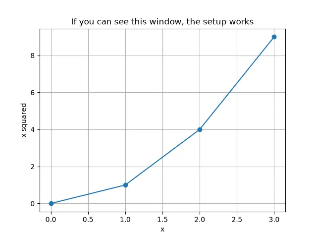
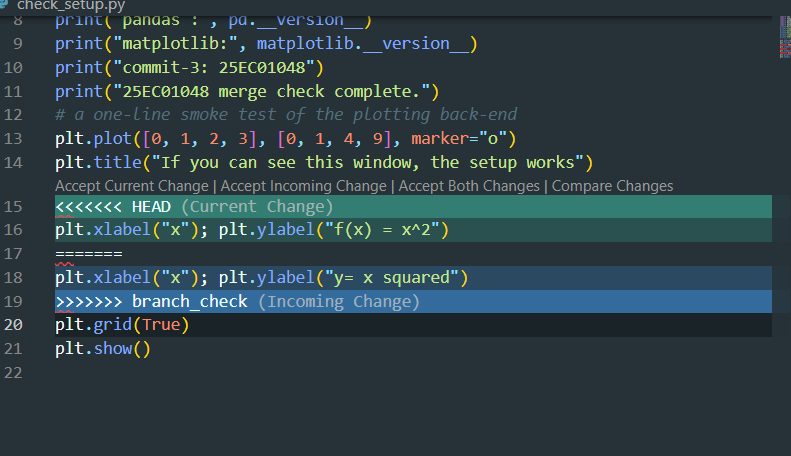
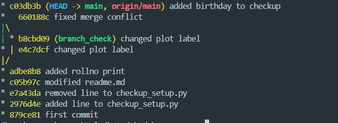
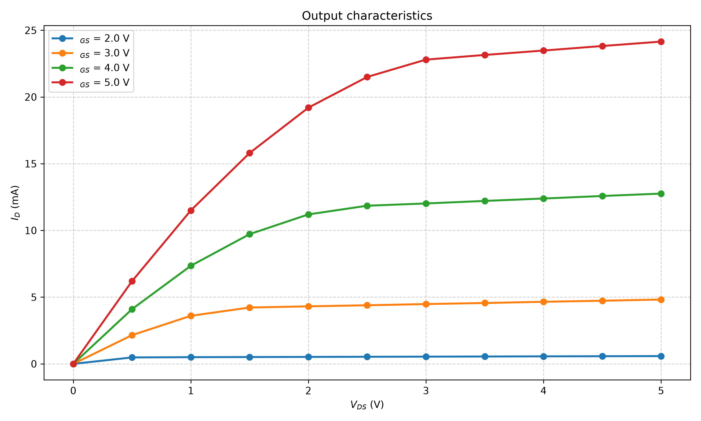
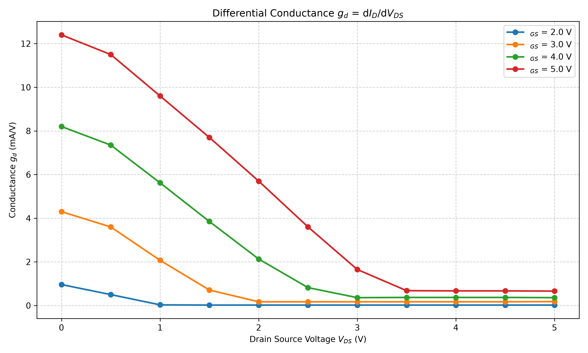
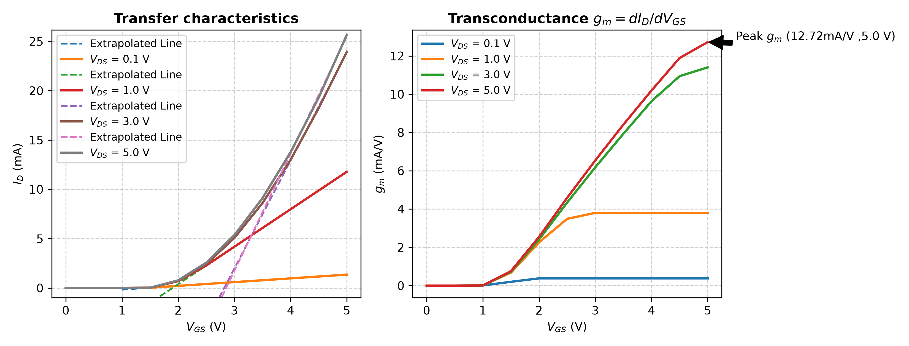
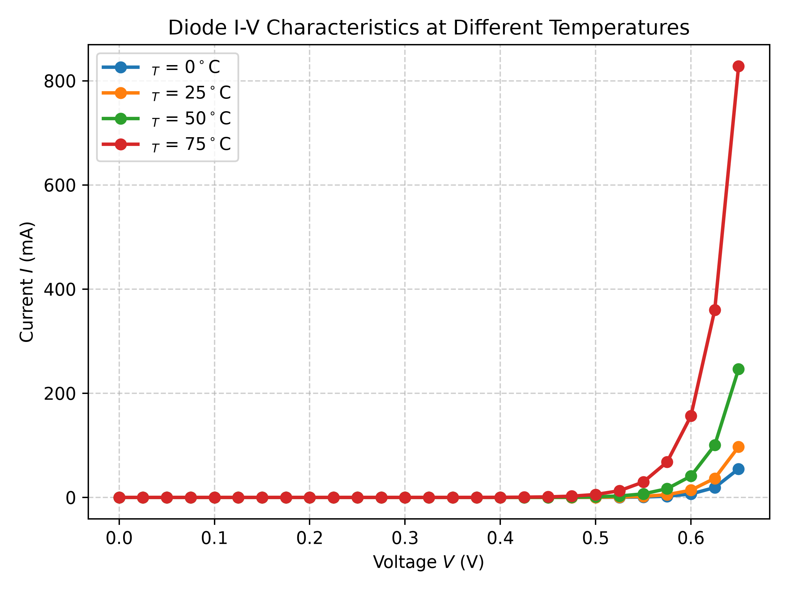
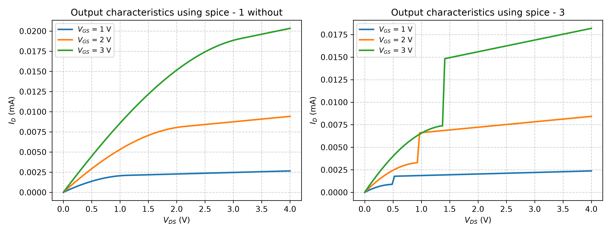

# Task -1 
Python : 3.13.12 \
numpy : 2.5.1   \
pandas : 3.0.5  \
matplotlib: 3.11.1 



# Task -2

* e7a43da (HEAD -> main) removed line to checkup_setup.py
* 2976d4e added line to checkup_setup.py
* 879ce81 first commit

# Task -4 




# Task -5 




# Task -6
####     V_GS (V)  V_DS (V)  I_D (mA)
0       2.0       0.0      0.00\
1       2.0       0.5      0.48\
2       2.0       1.0      0.50\
3       2.0       1.5      0.51\
4       2.0       2.0      0.52\
<br>
Index(['V_GS (V)', 'V_DS (V)', 'I_D (mA)'], dtype='str')
<br>
(44, 3)
####       V_GS (V)   V_DS (V)   I_D (mA)
count  44.00000  44.000000  44.000000\
mean    3.50000   2.500000   7.841591\
std     1.13096   1.599418   7.904722\
min     2.00000   0.000000   0.000000\
25%     2.75000   1.000000   0.557500\
50%     3.50000   2.500000   4.605000\
75%     4.25000   4.000000  12.255000\
max     5.00000   5.000000  24.150000


# Task -7
 <br>




# Task -8
 ro = 1/gd :  0.2 KΩ 
 <br>



# Task -9



# Task - 10
```python    
    v_t = np.array([])
    for v_ds, g in df.groupby('V_DS (V)'):
        highslope_gm = np.where(gm > 0.7 * gm.max())[0][0] # index from which the id graph goes almost straight
    
        coef = np.polyfit(g['V_GS (V)'][highslope_gm:], g['I_D (mA)'][highslope_gm:], 1)
            
        v_t_t = -coef[1]/coef[0] # threshold voltage from linear extrapolation
    
        v_t = np.append(v_t, v_t_t)
        polynomial = np.poly1d(coef)

            # 3. Define an extended X-range for extrapolation (e.g., up to x=10)
        x_extended = np.linspace(1, 5, 100)
        y_extrapolated = polynomial(x_extended)

            # 4. Plot the results
            # plt.scatter(x, y, color='blue', label='Original Data')
        ax[0].plot(x_extended, y_extrapolated, linestyle='--', label='Extrapolated Line')
        
    print(round(v_t.mean(), 2) ,' V is the average threshold voltage')

```
<b>
Output = 2.25  V is the average threshold voltage
</b>
<br>

# Task - 11 




# Task - 12 



