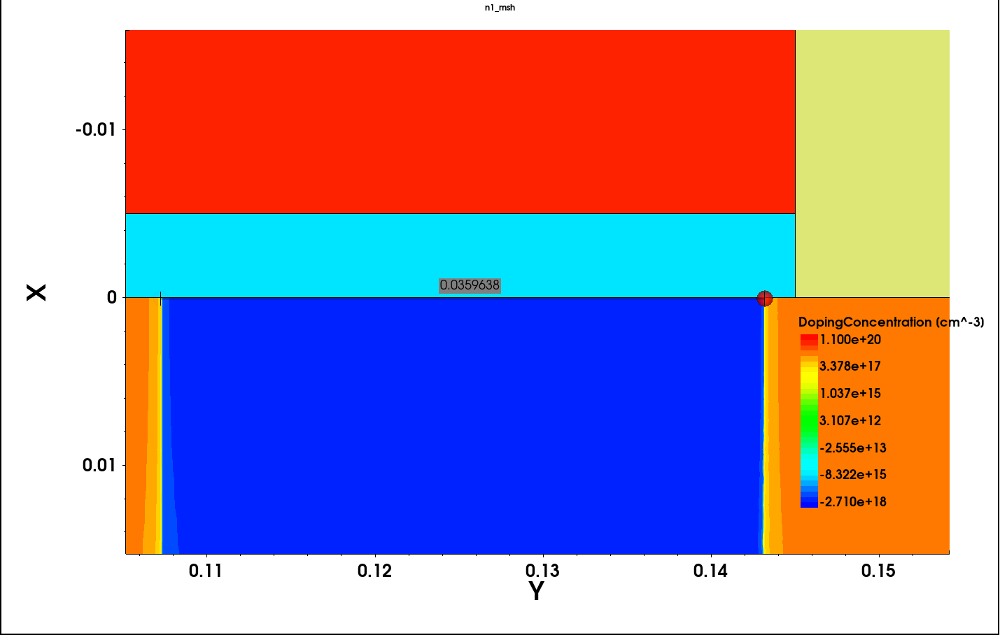

# TCAD Exercise - 25ec01021 25ec01048
## E1 Structure 

<b>Doping Concentration :</b>

<b>Vertex Count = 4896</b> \
Vertex count is no of node points formed from the meshing 

## E2 Specification
<b>Channel length : 36 nm</b>

<b>Peak channel doping  : 2.7e18 (negative indicating p type) </b> 

Doping along the cutline through middle 

Doping along the cutline at x = 8nm 

## E3 Equillibrium Analysis

## E4 

